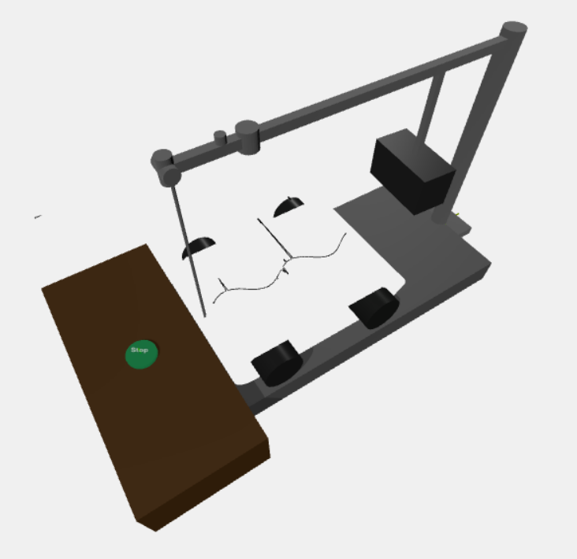

# 🎛️ Tape Machine Sim Version 1 🎚️

This project is live [here](https://cheddarbutler.com/threejs/tapemachinev1/)



A realistic 3D simulation of a classic seismograph/tape machine, built with Three.js. This interactive web application brings to life the intricate mechanics of a vintage recording device, complete with a moving needle and paper tape system.

## 🌟 Features

- 🎥 Realistic 3D visualization of a classic tape machine
- 🪡 Interactive needle movement simulation
- 📜 Dynamic paper tape system
- 🎮 Camera controls for detailed inspection
- 🎨 High-quality 3D models and textures
- 📱 Responsive design for various screen sizes

## 🚀 Getting Started

### Prerequisites

- A modern web browser (Chrome, Firefox, Safari, or Edge)
- Node.js (for local development)

### Installation

1. Clone the repository:
```bash
git clone [your-repository-url]
```

2. Navigate to the project directory:
```bash
cd tape-machine-sim
```

3. Install dependencies:
```bash
npm install
```

4. Open `index.html` in your browser or use a local server:
```bash
# Using Python
python -m http.server

# Using Node.js
npx serve
```

## 🛠️ Technical Details

- Built with Three.js for 3D rendering
- Custom GLB models for machine components
- Responsive CSS for optimal viewing experience
- Modular JavaScript architecture

## 🔮 Coming Soon

- 🐍 Python integration for advanced wave function analysis
- 🎚️ Additional control parameters for fine-tuning the simulation
- 📊 Data visualization features
- 🔄 Real-time data input capabilities

## 📁 Project Structure

```
tape-machine-sim/
├── index.html          # Main HTML file
├── main.js            # Core Three.js implementation
├── style.css          # Styling
├── textures/          # 3D models and textures
│   ├── needle.glb
│   ├── collection_box.glb
│   └── classic_seismograph_body_compact.glb
└── package.json       # Project dependencies
```

## 🤝 Contributing

Contributions are welcome! Please feel free to submit a Pull Request.

## 📝 License

This project is licensed under the MIT License - see the LICENSE file for details.

## 🙏 Acknowledgments

- Three.js community for the amazing 3D framework
- Original seismograph designs that inspired this simulation
- Cursor IDE for integrating everything and orchestrating the workflow


---
Made with ❤️ and ☕ 
